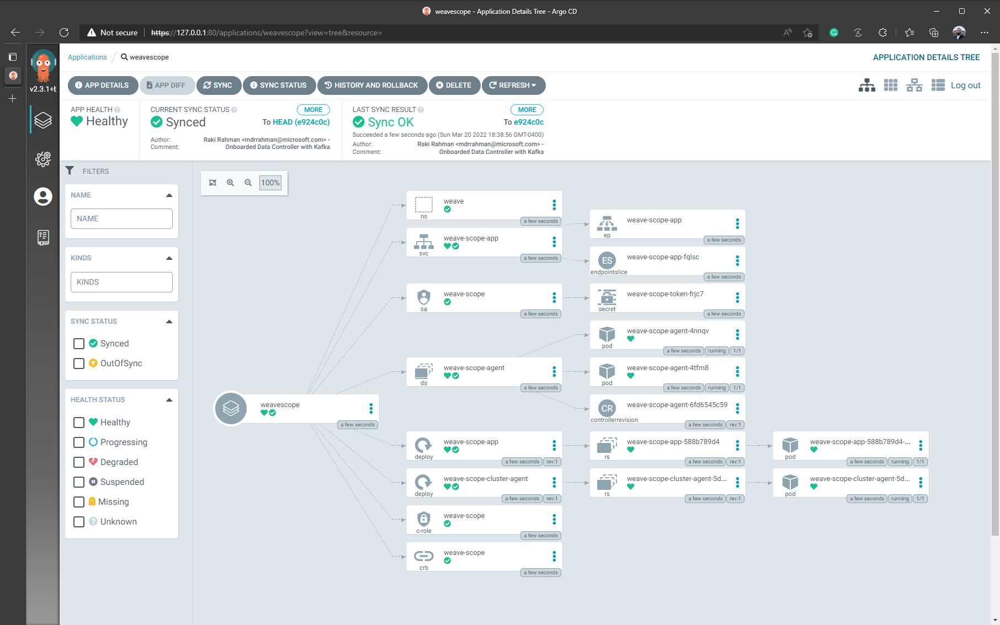
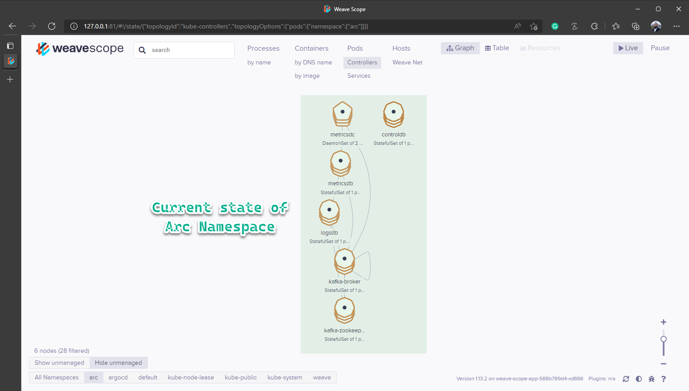

# Arc Data Benchmark - Monitoring and Scalability

A terraform-built scalable environment for coming up with a set of back-of-the-napkin calculations to determine guidance on topics like PV sizing, the number of supported SQL instances per Controller, retention settings and anything else related to **scalability**.

## Table of Contents <!-- omit in toc -->

- [A](#A)
  - [B](#B)

---

# TO-DO

- [ ] Increase Core limit in a region
- [x] Terraform AKS setup with:
  - [x] Container Insights and Log Analytics
  - [x] Plug-and-play new `NodePools`
- [x] `az` Data Controller Deploy with Kafka (Indirect mode)
- [x] Argo CD hookup with this repo
  - [x] ArgoCD setup
  - [x] Weavescope
  - [ ] SQL MI(s)
  - [ ] Kafdrop

---

# Dashboards/endpoints

There are a few different monitoring tools deployed in this environment, below are the endpoints:

| Tech       | Expose endpoint                                                        | Endpoint                 | Credentials             | Purpose                  |
| ---------- | ---------------------------------------------------------------------- | ------------------------ | ----------------------- | ------------------------ |
| Grafana    | `kubectl port-forward service/metricsui-external-svc -n arc 3000:3000` | `https://127.0.0.1:3000` | admin:acntorPRESTO!     | Data Services Metrics    |
| Kibana     | `kubectl port-forward service/logsui-external-svc -n arc 5601:5601`    | `https://127.0.0.1:5601` | admin:acntorPRESTO!     | Data Services Logs       |
| ArgoCD     | `kubectl port-forward service/argocd-server -n argocd 80:80`           | `https://127.0.0.1:80`   | admin:bqW0LFPfJiIS5BUD | CICD interface           |
| Weavescope | `kubectl port-forward service/weave-scope-app -n weave 81:80`          | `http://127.0.0.1:81`    | None                    | K8s monitoring interface |

---

## Infrastructure Deployment

### Dev Container

The folder `.devcontainer` has necessary tools (terraform, azure-cli, kubectl etc) to get started on this demo with [Remote Containers](https://code.visualstudio.com/docs/remote/containers).

### Terraform apply

The following script deploys the environment with Terraform:

```bash
# ---------------------
# ENVIRONMENT VARIABLES
# For Terraform
# ---------------------
# Secrets
export TF_VAR_SPN_CLIENT_ID=$spnClientId
export TF_VAR_SPN_CLIENT_SECRET=$spnClientSecret
export TF_VAR_SPN_TENANT_ID=$spnTenantId
export TF_VAR_SPN_SUBSCRIPTION_ID=$subscriptionId

# Module specific
export TF_VAR_resource_group_name='raki-jake-arc-benchmark-rg'

# ---------------------
# DEPLOY TERRAFORM
# ---------------------
cd terraform
terraform init
terraform plan
terraform apply -auto-approve

# ---------------------
# ‼ DESTROY ENVIRONMENT
# ---------------------
terraform destory
```

---

## Arc deployment

Before onboarding Argo, we onboard the Data Controller and get Kafka up with a manual workaround.

### Arc Data Services (without Kafka)

```bash
cd azure-arc

# Deployment variables
export random=$(echo $RANDOM | md5sum | head -c 5; echo;)
export resourceGroup=$TF_VAR_resource_group_name
export aksName='aks-benchmark'
export AZDATA_USERNAME='boor'
export AZDATA_PASSWORD='acntorPRESTO!'
export arcDcName='arc-dc'
export azureLocation='eastus'
export AZDATA_LOGSUI_USERNAME=$AZDATA_USERNAME
export AZDATA_METRICSUI_USERNAME=$AZDATA_USERNAME
export AZDATA_LOGSUI_PASSWORD=$AZDATA_PASSWORD
export AZDATA_METRICSUI_PASSWORD=$AZDATA_PASSWORD

# Login as service principal
az login --service-principal --username $spnClientId --password $spnClientSecret --tenant $spnTenantId
az account set --subscription $subscriptionId

# Get kubeconfig
az aks get-credentials --resource-group $TF_VAR_resource_group_name --name $aksName

# Create custom profile for AKS
az arcdata dc config init --source azure-arc-aks-default-storage --path custom --force

# Create with the AKS profile
az arcdata dc create --path './custom' \
                     --k8s-namespace arc \
                     --name $arcDcName \
                     --subscription $subscriptionId \
                     --resource-group $resourceGroup \
                     --location $azureLocation \
                     --connectivity-mode indirect \
                     --use-k8s

# Controller gets deployed, but no Kafka in this March release.

```

### Arc Data Services (_with_ Kafka)

We first have to delete the Data controller because `spec.monitoring.enablekafka=true` is immutable as of March 2022, then onboard it with Kafka from YAML definitions:

```bash
# Delete controller
kubectl delete datacontroller arc-dc -n arc

# Apply pre-canned YAMl file with spec.monitoring.enablekafka=true
kubectl apply -f /workspaces/arc-data-benchmark/azure-arc/controller-kafka/controller-kafka.yaml

```

---

## ArgoCD deployment

```bash
# Argo namespace
kubectl create namespace argocd

# Deploy Argo
kubectl apply -n argocd -f https://raw.githubusercontent.com/argoproj/argo-cd/stable/manifests/install.yaml

# Patch Service to be externally accessible
kubectl patch svc argocd-server -n argocd -p '{"spec": {"type": "LoadBalancer"}}'

# Get secret
kubectl -n argocd get secret argocd-initial-admin-secret -o jsonpath="{.data.password}" | base64 -d && echo
```

---

## Weavescope

Follow the simple steps here to get Weavescope onboarded: https://www.buchatech.com/2021/12/deploy-app-to-azure-kubernetes-service-via-argo-cd/


And we see the UI:


---

## SQL MIs


---

# Questions to Answer

## `logsdb` volume

#### Q: How should you size your `logsdb` volume?

A: TBD

#### Q: What volume of logs are created on cluster deployment?

A: TBD

#### Q: At what rate does the control plane produce logs with no data service instances and no errors?

A: TBD

#### Q: What volume of logs are created on sqlmi creation?

A: TBD

#### Q: At what rate are sqlmi logs produced over time per instance? Per replica?

A: TBD

#### Q: All of the above, but for Kafka too

A: TBD

#### Q: How should you size your `metricsdb` volume?

A: TBD

#### Q: At what rate are `metricsdc` logs produced per node? Is this significant enough to be factored into the calculation?

A: TBD

---

## Log retention settings

#### Q: How should you set your logs retention settings?

A: TBD

#### Q: This is basically the same question as how to size your logsdb volume. Retention = volume_size / avg_logs_per_day

A: TBD

#### Q: Also note this feature is in progress (planned default is two weeks)

A: TBD

---

## Scalability

#### Q: How many sqlmi instances/replicas can you run per data controller? (Assuming logs/metrics retention is not the bottleneck)

> Not sure what specific benchmarks we need for this beyond just slowly increasing on a big cluster and seeing what happens.

A: TBD

#### Q: What’s the rate of collection per day per `sqlmi` CR instance? Per replica?

A: TBD

#### Q: What is the rate of metrics collection per node? (when enabled)

A: TBD

#### Q: Should we be piping all logs files into elastic/influx? What can we exclude?

A: TBD

#### Q: Should we offer settings to control the level of logs collection on a per file basis?

A: TBD

#### Q: Can we add info/debug/error level metadata to every log file?

A: TBD

---

## Misc

#### Q: How can we stop errors from spamming the logs?

A: TBD

#### Q: How do customers resize monitoring resources as we increase our collection? (e.g. `PV` resize)

A: TBD

#### Q: Does Indirect VS Direct mode increase the amount of logs generated for the same setup?

A: TBD

#### Q: Does Transactions happening on an MI (e.g. HammerDB) increase the amount of logs/metrics generated?

A: TBD

---

# Useful Kusto queries

## Query 1: TBD

```sql
SELECT * FROM FOO
```

Diagram: TBD

---

# Misc notes

---

# Gotchas/lessons-learned

TBD
