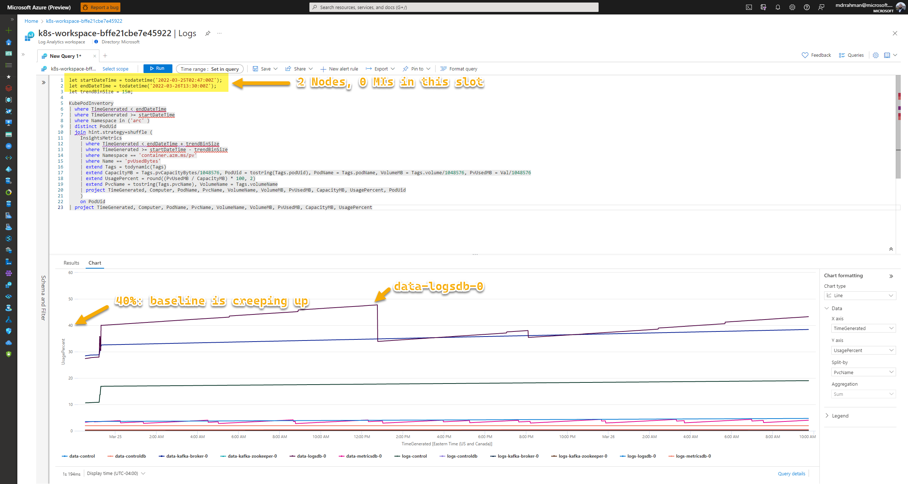
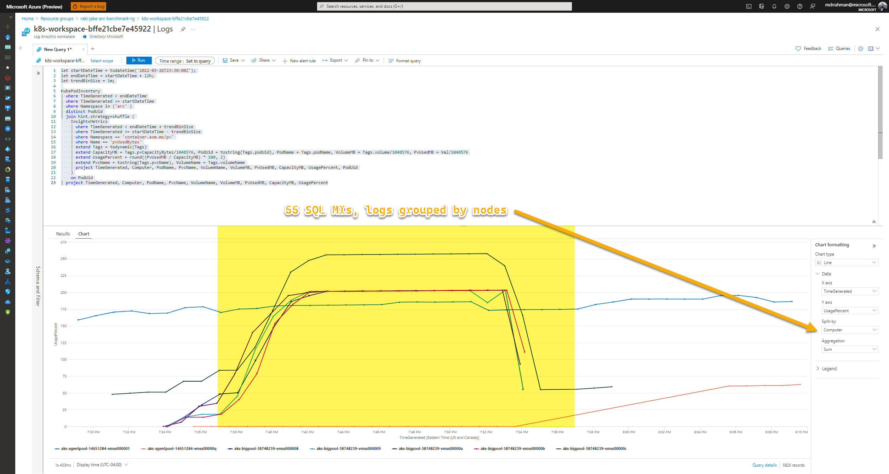

# Arc Data Benchmark - Monitoring and Scalability

A terraform-built scalable environment for coming up with a set of back-of-the-napkin calculations to determine guidance on topics like PV sizing, the number of supported SQL instances per Controller, retention settings and anything else related to **scalability**.

## Table of Contents <!-- omit in toc -->

- [Dashboards and endpoints](#dashboards)
- [Environment Deployment](#deployment)
  - [Development Container](##dev-container)
  - [AKS via Terraform](##terraform)
  - [Arc Data deployment](##arc-data-deployment)
    - [No Kafka](###no-kafka)
    - [With Kafka](###with-kafka)
  - [ArgoCD](##argocd)
  - [Weavescope](##weavescope)
- [Experiment setup](#experiment-setup)
- [Experiment execution](#experiment-execution)
- [Useful snippets](#useful-snippets)
- [Experiment observations](#observations)
- [Calculations](#calculations)
- [Questions to Answer](#questions-to-answer)
- [Lessons Learned](#lessons-learned)

---

# TO-DO

- [x] Increase Core limit in a region
- [x] Terraform AKS setup with:
  - [x] Container Insights and Log Analytics
  - [x] Plug-and-play new `NodePools`
- [x] **`az`** Data Controller Deploy with Kafka (Indirect mode)
- [x] Monitoring and Gitops hookup with this repo
  - [x] ArgoCD setup
  - [x] Weavescope
  - [x] SQL MI(s)
- [x] Experiments
  - [x] **Experiment 1**: Effect of nodes (since `metricsdc` runs as `DaemonSet`) on Log Volumes - ✔
  - [x] **Experiment 2**: Effect of instances on Log Volumes
  - [x] **Experiment 3**: Effect of replicas (1, 2, 3) on Log Volumes
  - [x] **Experiment 4**: Max # of MIs you can deploy at once (assume infra is there)
    - [x] **Experiment 5**: Max # of MIs a Controller can handle at most without bugging out (assume infra is there)
- [] Calculations
- [] Answer questions

---

# Dashboards

There are a few different monitoring tools deployed in this environment, below are the endpoints:

| Tech       | Expose endpoint                                                         | Endpoint                 | Credentials                                        | Purpose                  |
| ---------- | ----------------------------------------------------------------------- | ------------------------ | -------------------------------------------------- | ------------------------ |
| Grafana    | `kubectl port-forward service/metricsui-external-svc -n arc 3000:3000`  | `https://127.0.0.1:3000` | admin:acntorPRESTO!                                | Data Services Metrics    |
| Kibana     | `kubectl port-forward service/logsui-external-svc -n arc 5601:5601`     | `https://127.0.0.1:5601` | admin:acntorPRESTO!                                | Data Services Logs       |
| ArgoCD     | `kubectl port-forward service/argocd-server -n argocd 80:80`            | `https://127.0.0.1:80`   | admin:rnHFlEtXSwf5aDMx                             | CICD interface           |
| Weavescope | `kubectl port-forward service/weave-scope-app -n weave 81:80`           | `http://127.0.0.1:81`    | None                                               | K8s monitoring interface |
| FSM        | `kubectl port-forward service/controldb-svc -n arc 1433:1433`           | `127.0.0.1,1433`         | controldb-rw-user:Xk3Ie43zXHA-QtvDsZGpsiOZcYXyNchz | ControllerDB             |
| SQL MI     | `kubectl port-forward service/sql-gp-1-external-svc -n arc 31433:31433` | `127.0.0.1,1433`         | boor:acntorPRESTO!                                 | SQL MI CAG endpoint      |

---

# Deployment

## Dev Container

The folder `.devcontainer` has necessary tools (terraform, azure-cli, kubectl etc) to get started on this demo with [Remote Containers](https://code.visualstudio.com/docs/remote/containers).

## Terraform

The following script deploys the environment with Terraform:

```bash
# ---------------------
# ENVIRONMENT VARIABLES
# For Terraform
# ---------------------
# Secrets
export TF_VAR_SPN_CLIENT_ID=$spnClientId
export TF_VAR_SPN_CLIENT_SECRET=$spnClientSecret
export TF_VAR_SPN_TENANT_ID=$spnTenantId
export TF_VAR_SPN_SUBSCRIPTION_ID=$subscriptionId

# Module specific
export TF_VAR_resource_group_name='raki-jake-arc-benchmark-rg'

# ---------------------
# DEPLOY TERRAFORM
# ---------------------
cd terraform
terraform init
terraform plan
terraform apply -auto-approve

# ---------------------
# ‼ DESTROY ENVIRONMENT
# ---------------------
terraform destory
```

---

## Arc Data deployment

Before onboarding Argo, we onboard the Data Controller and get Kafka up with a manual workaround.

### No Kafka

```bash
cd azure-arc

# Deployment variables
export random=$(echo $RANDOM | md5sum | head -c 5; echo;)
export resourceGroup=$TF_VAR_resource_group_name
export aksName='aks-benchmark'
export AZDATA_USERNAME='boor'
export AZDATA_PASSWORD='acntorPRESTO!'
export arcDcName='arc-dc'
export azureLocation='eastus'
export AZDATA_LOGSUI_USERNAME=$AZDATA_USERNAME
export AZDATA_METRICSUI_USERNAME=$AZDATA_USERNAME
export AZDATA_LOGSUI_PASSWORD=$AZDATA_PASSWORD
export AZDATA_METRICSUI_PASSWORD=$AZDATA_PASSWORD

# Login as service principal
az login --service-principal --username $spnClientId --password $spnClientSecret --tenant $spnTenantId
az account set --subscription $subscriptionId

# Get kubeconfig
az aks get-credentials --resource-group $TF_VAR_resource_group_name --name $aksName

# Create custom profile for AKS
az arcdata dc config init --source azure-arc-aks-default-storage --path custom --force

# Create with the AKS profile
az arcdata dc create --path './custom' \
                     --k8s-namespace arc \
                     --name $arcDcName \
                     --subscription $subscriptionId \
                     --resource-group $resourceGroup \
                     --location $azureLocation \
                     --connectivity-mode indirect \
                     --use-k8s

# Controller gets deployed, but no Kafka in this March release.

```

### With Kafka

We first have to delete the Data controller because `spec.monitoring.enablekafka=true` is immutable as of March 2022, then onboard it with Kafka from YAML definitions:

```bash
# Delete controller
kubectl delete datacontroller arc-dc -n arc

# Apply pre-canned YAMl file with spec.monitoring.enablekafka=true
kubectl apply -f /workspaces/arc-data-benchmark/azure-arc/controller-kafka/controller-kafka.yaml

```

---

## ArgoCD

```bash
# Argo namespace
kubectl create namespace argocd

# Deploy Argo
kubectl apply -n argocd -f /workspaces/arc-data-benchmark/kubernetes/argocd/argo.yaml

# Patch Service to be externally accessible
kubectl patch svc argocd-server -n argocd -p '{"spec": {"type": "LoadBalancer"}}'

# Get secret
kubectl -n argocd get secret argocd-initial-admin-secret -o jsonpath="{.data.password}" | base64 -d && echo
```

And we deploy SQL MIs via Argo:

```bash
kubectl apply -f /workspaces/arc-data-benchmark/kubernetes/argocd-config/sqlmi.yaml -n argocd
```

And we see the SQL MI resources in the UI:


---

## Weavescope

Follow the simple steps here to get Weavescope onboarded: https://www.buchatech.com/2021/12/deploy-app-to-azure-kubernetes-service-via-argo-cd/

**YAML file:** `/workspaces/arc-data-benchmark/kubernetes/argocd-config/weavescope.yaml`


And we see the UI:


---

# Experiment setup

### Effect of logs

- **Experiment 1**: Effect of nodes (since `metricsdc` runs as `DaemonSet`) on Log Volumes - ✔
- **Experiment 2**: Effect of instances on Log Volumes
- **Experiment 3**: Effect of replicas (1, 2, 3) on Log Volumes

### Max limits per controller

- **Experiment 4**: Max # of MIs you can deploy at once (assume infra is there)
- **Experiment 5**: Max # of MIs a Controller can handle at most without bugging out (assume infra is there)

### Things we want to track

- Nodes - number, sizes
- MIs - number, replicas, size
- Deployment timestamp start, end

### The equation

We want to model this for all of our PVCs

```text
data-control
data-controldb
data-kafka-broker-0
data-kafka-zookeeper-0
data-logsdb-0
data-metricsdb-0
logs-control
logs-controldb
logs-kafka-broker-0
logs-kafka-zookeeper-0
logs-logsdb-0
logs-metricsdb-0
```


---

# Experiment execution

> Script to generate query result timestamp: `$Date = Get-Date; $Date.ToString() -replace(":", "-") -replace("/", "-")`

#### **Experiment 1**: Effect of nodes (since `metricsdc` runs as `DaemonSet`) on Log Volumes - ✔

| #   | Timestamp (UTC)      | Step performed                              | Clusters | Nodes (no Autoscale) | MIs | Query results                        | Comments                                          |
| --- | -------------------- | ------------------------------------------- | -------- | -------------------- | --- | ------------------------------------ | ------------------------------------------------- |
| 1   | 2022-03-23T00:00:00Z | Deployed base Terraform module + Controller | 1        | 2*DS3_V2, 0*DS5_v2   | 0   | 2022-03-22 9-10-22 PM.csv            | Baseline setup for Arc Indirect                   |
| 2   | 2022-03-23T01:26:00Z | Scaled up node to 3                         | 1        | 3*DS3_V2, 0*DS5_v2   | 0   | 2022-03-22 9-40-16 PM.csv            | Looking at impact of nodes increase on log volume |
| 3   | 2022-03-23T01:47:00Z | Scaled up node to 10                        | 1        | 10*DS3_V2, 0*DS5_v2  | 0   | 2022-03-22 9-56-14 PM.csv            | Looking at impact of nodes increase on log volume |
| 4   | 2022-03-23T02:05:00Z | Scaled up node to 25 (max)                  | 1        | 25*DS3_V2, 0*DS5_v2  | 0   | 2022-03-22 10-34-02 PM.csv           | Looking at impact of nodes increase on log volume |
| 5   | 2022-03-23T02:34:00Z | None                                        | 1        | 25*DS3_V2, 0*DS5_v2  | 0   | 2022-03-22 10-42-30 PM_nodes_e2e.csv | Final snapshot of nodes                           |
| 6   | 2022-03-23T02:34:00Z | Scaled down node to 2                       | 1        | 2*DS3_V2, 0*DS5_v2   | 0   | None                                 | Back down to normal                               |

#### **Experiment 2**: Effect of SQL MIs on Log Volumes - ✔

| #   | Timestamp (UTC)      | Step performed      | Clusters | Nodes (no Autoscale) | MIs | Query results              | Comments                                 |
| --- | -------------------- | ------------------- | -------- | -------------------- | --- | -------------------------- | ---------------------------------------- |
| 1   | 2022-03-23T12:00:00Z | None                | 1        | 2*DS3_V2, 0*DS5_v2   | 0   | 2022-03-23 8-48-54 AM.csv  | Baseline setup before MI deploy          |
| 2   | 2022-03-23T12:59:00Z | +1 GP MI            | 1        | 2*DS3_V2, 0*DS5_v2   | 1   | 2022-03-24 8-30-00 AM.csv  | Deployed +1 MI                           |
| 3   | 2022-03-24T12:46:00Z | +1 GP MI            | 1        | 2*DS3_V2, 0*DS5_v2   | 2   | 2022-03-24 9-09-55 PM.csv  | Deployed +1 MI                           |
| 4   | 2022-03-25T01:24:00Z | +1 DS5_v2 node      | 1        | 2*DS3_V2, 1*DS5_v2   | 2   | 2022-03-24 9-47-03 PM.csv  | Deployed +1 Node since out of memory     |
| 5   | 2022-03-25T01:58:00Z | +5 GP MI            | 1        | 2*DS3_V2, 1*DS5_v2   | 7   | 2022-03-24 10-31-04 PM.csv | Deployed +5 MIs to see if 5x logs slope  |
| 6   | 2022-03-25T02:47:00Z | -7 GP MIs - 1 nodes | 1        | 2*DS3_V2, 0*DS5_v2   | 0   | None                       | Removed MIs and big node as test is over |

#### **Experiment 3**: Effect of replicas (1, 2, 3) on Log Volumes - ✔

| #   | Timestamp (UTC)      | Step performed         | Clusters | Nodes (no Autoscale) | MIs         | Query results              | Comments                                     |
| --- | -------------------- | ---------------------- | -------- | -------------------- | ----------- | -------------------------- | -------------------------------------------- |
| 0   | 2022-03-26T13:30:00Z | None                   | 1        | 2*DS3_V2, 0*DS5_v2   | 0           | 2022-03-26 10-04-40 AM.csv | Baseline setup before node scale             |
| 1   | 2022-03-26T13:55:00Z | +1 DS3_v2 node         | 1        | 3*DS3_V2, 0*DS5_v2   | 0           | 2022-03-26 10-12-30 AM.csv | Spin up node for replica test                |
| 2   | 2022-03-26T14:21:00Z | +1 GP MI               | 1        | 3*DS3_V2, 0*DS5_v2   | 1x1 replica | 2022-03-26 1-13-44 PM.csv  | Deployed +1 MI, 1 Replica                    |
| 3   | 2022-03-26T17:23:00Z | -1 GP MI, +1 BC MI x 2 | 1        | 3*DS3_V2, 0*DS5_v2   | 1x2 replica | 2022-03-26 2-37-01 PM.csv  | Deleted previous, Deployed +1 BC, 2 Replicas |
| 4   | 2022-03-26T18:45:00Z | -1 BC MI, +1 BC MI x 3 | 1        | 3*DS3_V2, 0*DS5_v2   | 1x3 replica | 2022-03-26 4-48-52 PM.csv  | Deleted previous, Deployed +1 BC, 3 Replicas |
| 5   | 2022-03-26T21:00:00Z | -1 BC MIs - 1 nodes    | 1        | 2*DS3_V2, 0*DS5_v2   | 0           | None                       | Removed MIs and node as test is over         |

#### **Experiment 4**: Max # of MIs you can deploy at once (assume infra is there) - ✔

| #   | Timestamp (UTC)      | Step performed               | Clusters | Nodes (no Autoscale) | MIs | Query results                        | Comments                                     |
| --- | -------------------- | ---------------------------- | -------- | -------------------- | --- | ------------------------------------ | -------------------------------------------- |
| 1   | 2022-03-26T21:25:00Z | +5 DS5_v2                    | 1        | 2*DS3_V2, 5*DS5_v2   | 0   | 2022-03-26 5-32-01 PM.csv            | Spin up big nodes for stress test            |
| 2   | 2022-03-26T23:30:00Z | +55 GP MIs                   | 1        | 2*DS3_V2, 5*DS5_v2   | 55  | 2022-03-26 8-16-00 PM_55-sql-mis.csv | (110 GB - 2 GB (used))/ 2 GB Per MI = 55 MIs |
| 3   | 2022-03-26T23:59:00Z | -55 GP MIs, - 5 DS5_v2 nodes | 1        | 2*DS3_V2, 0*DS5_v2   | 0   | None                                 | Removed MIs and nodes as test is over        |

---

# Useful snippets

## Delete stale PVCs

```bash
cd /workspaces/arc-data-benchmark/scripts
chmod u+x delete-pvc.sh
./delete-pvc.sh
```

## FSM login

```bash
# Get creds
kubectl get secret controller-db-rw-secret -n arc -o go-template='{{.data.username}}' | base64 -d
kubectl get secret controller-db-rw-secret -n arc -o go-template='{{.data.password}}' | base64 -d

# Port forward FSM SQL Server
kubectl port-forward service/controldb-svc -n arc 1433:1433
# Instance: 127.0.0.1
```

## `n` number of MIs appended

```bash
cd /workspaces/arc-data-benchmark/scripts
chmod u+x append_mis.sh
./append_mis.sh

# Check dry run
kubectl apply --dry-run=client -f /workspaces/arc-data-benchmark/kubernetes/sqlmi/sql-gp.yaml
# sqlmanagedinstance.sql.arcdata.microsoft.com/sql-gp-1 created (dry run)
# ..
# sqlmanagedinstance.sql.arcdata.microsoft.com/sql-gp-55 created (dry run)
```

## Query 1: Grab usage metrics for all PVCs

The following query returns all PVCs:

```sql
let T1 = todatetime('2022-03-23T00:35:00Z'); // Experiment Step started
let T2 = todatetime('2022-03-23T01:00:00Z'); // Experiment Step before end - minus 5 mins
let trendBinSize = 5m;
let Name = 'logs-controldb';

KubePodInventory
| where TimeGenerated < T2
| where TimeGenerated >= T1
| where Namespace in ('arc' )
| distinct PodUid
| join hint.strategy=shuffle (
    InsightsMetrics
    | where TimeGenerated < T2 + trendBinSize
    | where TimeGenerated >= T1 - trendBinSize
    | where Namespace == 'container.azm.ms/pv'
    | where Name == 'pvUsedBytes'
    | extend Tags = todynamic(Tags)
    | extend CapacityMB = Tags.pvCapacityBytes/1048576, PodUid = tostring(Tags.podUid), PodName = Tags.podName, PvUsedMB = Val/1048576
    | extend UsagePercent = round((PvUsedMB / CapacityMB) * 100, 2)
    | extend PvcName = tostring(Tags.pvcName), VolumeName = Tags.volumeName
    | project TimeGenerated, PvcName, VolumeName, PvUsedMB, CapacityMB, UsagePercent, PodUid
    )
    on PodUid
| project TimeGenerated, PvcName, PvUsedMB, CapacityMB
| order by TimeGenerated asc
| where PvcName == Name
```

## Query 2: Center around the time when a change was executed (e.g. node spinup)

```sql
let changeTime = todatetime('2022-03-23T01:26:00Z');
let startDateTime = changeTime - 5m;
let endDateTime = changeTime + 15m;
let trendBinSize = 1m;
```

## Query 3: Get PVC capacities at a snapshot/range

```sql
let T1 = todatetime('2022-03-23T00:00:00Z'); // Experiment Step started
let T2 = todatetime('2022-03-23T02:34:00Z'); // Experiment Step before end
let trendBinSize = 5m;

KubePodInventory
| where TimeGenerated < T2
| where TimeGenerated >= T1
| where Namespace in ('arc' )
| distinct PodUid
| join hint.strategy=shuffle (
    InsightsMetrics
    | where TimeGenerated < T2 + trendBinSize
    | where TimeGenerated >= T1 - trendBinSize
    | where Namespace == 'container.azm.ms/pv'
    | where Name == 'pvUsedBytes'
    | extend Tags = todynamic(Tags)
    | extend CapacityMB = Tags.pvCapacityBytes/1048576, PodUid = tostring(Tags.podUid), PodName = Tags.podName, PvUsedMB = Val/1048576
    | extend UsagePercent = round((PvUsedMB / CapacityMB) * 100, 2)
    | extend PvcName = tostring(Tags.pvcName), VolumeName = Tags.volumeName
    | project TimeGenerated, PvcName, VolumeName, PvUsedMB, CapacityMB, UsagePercent, PodUid
    )
    on PodUid
| project TimeGenerated, PvcName, PvUsedMB, CapacityMB, UsagePercent
```

---

# Observations

### **Experiment 1**: Effect of nodes (since `metricsdc` runs as `DaemonSet`) on Log Volumes - ✔

Baseline - `2022-03-22 9-10-22 PM.csv`:


Scaled up node to 3 - `2022-03-22 9-40-16 PM.csv`:


Scaled up node to 10 - `2022-03-22 9-56-14 PM.csv`:


Scaled up node to 25 - ``:


Start to end view:


### **Experiment 2**: Effect of SQL MIs on Log Volumes - ✔

Baseline - `2022-03-23 8-48-54 AM.csv`:


Scaled up MI to 1, running for ~24 hours - `2022-03-22 9-40-16 PM.csv`:


Scaled up MI to 2, running for ~12 hours - `2022-03-24 9-09-55 PM.csv`:


Zooming in on the spike:


Scaled up MI to 7 and nodes to 3, running for ~15 mins - `2022-03-24 10-31-04 PM.csv`:


Start to end view:


### **Experiment 3**: Effect of replicas (1, 2, 3) on Log Volumes

Baseline - `2022-03-26 10-04-40 AM.csv`:

> Note that even though we haven't had any SQL MIs running past few days `Nodes: 2*DS3_V2, 0*DS5_v2 | MI: 0`, baseline PVC usage has been going up
> 

Baseline with 3 Nodes, 0 MIs - `2022-03-26 10-12-30 AM.csv`:


1x1 Replica (GP) - `2022-03-26 1-13-44 PM.csv`:


1x2 Replica (BC) - `2022-03-26 2-37-01 PM.csv`:


1x3 Replica (BC) - `2022-03-26 4-48-52 PM`:


Start to end view:


### **Experiment 4**: Max # of MIs you can deploy at once (assume infra is there)

#### End-to-end recording of deployment and cleanup

[](https://youtu.be/s5x_y1fRZDs)

55 MIs spun up - `2022-03-26 8-16-00 PM_55-sql-mis.csv`:


PVC usage grouped by nodes:


PVC usage grouped by PVCs:


**Observations**

- LogsDB, Kafka Broker, and Controller PVC log sizes aggressively increase nearing 100%
- During spinup of MIs, Controller goes into an error state a few times, but recovers - all 55 SQL MIs go into `Ready` without any manual intervention
- During spindown of MIs, Controller doesn’t recover from deadlock state. Manual intervention is needed - killing Controller pod recovers the state and FSM error logs get cleaned up - see `3:00` minute mark

#### Errors

The following errors were encountered in the FSM:

```xml
<Exception>
  <Message>Transaction (Process ID 61) was deadlocked on lock resources with another process and has been chosen as the deadlock victim. Rerun the transaction.</Message>
  <Type>System.Data.SqlClient.SqlException</Type>
  <StackTrace>   at System.Data.SqlClient.SqlConnection.OnError(SqlException exception, Boolean breakConnection, Action`1 wrapCloseInAction)
   at System.Data.SqlClient.TdsParser.ThrowExceptionAndWarning(TdsParserStateObject stateObj, Boolean callerHasConnectionLock, Boolean asyncClose)
   at System.Data.SqlClient.TdsParser.TryRun(RunBehavior runBehavior, SqlCommand cmdHandler, SqlDataReader dataStream, BulkCopySimpleResultSet bulkCopyHandler, TdsParserStateObject stateObj, Boolean&amp; dataReady)
   at System.Data.SqlClient.SqlCommand.FinishExecuteReader(SqlDataReader ds, RunBehavior runBehavior, String resetOptionsString)
   at System.Data.SqlClient.SqlCommand.RunExecuteReaderTds(CommandBehavior cmdBehavior, RunBehavior runBehavior, Boolean returnStream, Boolean async, Int32 timeout, Task&amp; task, Boolean asyncWrite, SqlDataReader ds)
   at System.Data.SqlClient.SqlCommand.InternalExecuteNonQuery(TaskCompletionSource`1 completion, Boolean sendToPipe, Int32 timeout, Boolean asyncWrite, String methodName)
   at System.Data.SqlClient.SqlCommand.ExecuteNonQuery()
   at Microsoft.SqlServer.Controller.Core.DatabaseOperations.ExecuteNonQuery(String sqlQuery, SqlParameter[] queryParams, Boolean openSymmetricKey, SqlTransaction transaction)
   at Microsoft.SqlServer.Controller.Core.DatabaseOperations.ExecuteNonQuery(String sqlQuery, IDictionary`2 queryParams, Boolean openSymmetricKey, SqlTransaction transaction)
   at Microsoft.SqlServer.Controller.Core.Configuration.ManifestFile.ManifestFileManager.DeleteManifest(String scaledSetNamespace, String scaledSetName)
   at System.Collections.Generic.List`1.ForEach(Action`1 action)
   at Microsoft.SqlServer.Controller.Core.ResourceComposition.Providers.Management.ConfigurationFeatureProvider.DeleteResource(ExecutionContext context, CustomResourceConfigurationsMetadata spec)
   at System.Collections.Generic.List`1.ForEach(Action`1 action)
   at Microsoft.SqlServer.Controller.Core.ResourceComposition.ResourceComponentScheduler.Delete(ExecutionContext context, IEnumerable`1 resourceComponents)
   at Microsoft.SqlServer.Controller.Core.Plugin.Platform.CustomResourceStateMachine.DeletingResourcesTransition(ActionOutcome&amp; actionOutcome)</StackTrace>
</Exception>
---
<Exception>
  <Message>could not initiate new preferred primary request, pending request in progress</Message>
  <Type>Microsoft.SqlServer.Controller.Core.Exceptions.ControllerException</Type>
  <StackTrace>   at Microsoft.SqlServer.Controller.Plugin.SqlManagedInstance.AvailabilityGroupFeatureProvider.SetPreferredPrimaryReplica(ExecutionContext context, AvailabilityGroupSpec spec)</StackTrace>
</Exception>
---
<Exception>
  <Message>Object reference not set to an instance of an object.</Message>
  <Type>System.NullReferenceException</Type>
  <StackTrace>   at Microsoft.SqlServer.Controller.Plugin.SqlManagedInstance.SqlManagedInstanceProvisioner.PostCreationAction(IFiniteStateMachineContext fsmContext, PrePostActionContext actionContext)
   at Microsoft.SqlServer.Controller.Core.Plugin.Platform.CustomResourceStateMachine.PostCreationActionTransition(ActionOutcome&amp; actionOutcome)</StackTrace>
</Exception>
---
<Exception>
  <Message>Not Found: {"kind":"Status","apiVersion":"v1","metadata":{},"status":"Failure","message":"roles.rbac.authorization.k8s.io "sql-gp-36-ha-role" not found","reason":"NotFound","details":{"name":"sql-gp-36-ha-role","group":"rbac.authorization.k8s.io","kind":"roles"},"code":404}
</Message>
  <Type>k8s.KubernetesException</Type>
  <StackTrace>   at Microsoft.SqlServer.Kubernetes.Client.KubernetesUtils.CallKubernetesWithCustomErrorHandling[T](Func`1 action, Boolean ignoreConflict, Boolean ignoreNotFound)
   at Microsoft.SqlServer.Kubernetes.Client.KubernetesClient.PatchRole(JsonPatchDocument`1 patch, String roleName, String clusterNamespace)
   at Microsoft.SqlServer.Controller.Core.ResourceComposition.Providers.K8s.RoleFeatureProvider.CreateUpdateResource(ExecutionContext context, V1Role spec)</StackTrace>
  <InnerException>
    <Message>Operation returned an invalid status code 'NotFound'</Message>
    <Type>Microsoft.Rest.HttpOperationException</Type>
    <StackTrace>   at k8s.Kubernetes.PatchNamespacedRoleWithHttpMessagesAsync(V1Patch body, String name, String namespaceParameter, String dryRun, String fieldManager, Nullable`1 force, String pretty, Dictionary`2 customHeaders, CancellationToken cancellationToken)
   at k8s.KubernetesExtensions.PatchNamespacedRoleAsync(IKubernetes operations, V1Patch body, String name, String namespaceParameter, String dryRun, String fieldManager, Nullable`1 force, String pretty, CancellationToken cancellationToken)
   at k8s.KubernetesExtensions.PatchNamespacedRole(IKubernetes operations, V1Patch body, String name, String namespaceParameter, String dryRun, String fieldManager, Nullable`1 force, String pretty)
   at Microsoft.SqlServer.Kubernetes.Client.KubernetesClient.&lt;&gt;c__DisplayClass79_0.&lt;PatchRole&gt;b__0()
   at Microsoft.SqlServer.Kubernetes.Client.KubernetesUtils.CallKubernetesWithCustomErrorHandling[T](Func`1 action, Boolean ignoreConflict, Boolean ignoreNotFound)</StackTrace>
  </InnerException>
</Exception>
---
<Exception>
  <Message>availability group "sql-gp-12" does not exist</Message>
  <Type>Microsoft.SqlServer.Controller.Core.Exceptions.ControllerException</Type>
  <StackTrace>   at Microsoft.SqlServer.Controller.Plugin.SqlManagedInstance.AvailabilityGroupFeatureProvider.SetPreferredPrimaryReplica(ExecutionContext context, AvailabilityGroupSpec spec)</StackTrace>
</Exception>
---
<Exception>
  <Message>ConfigMap sql-config-sql-gp-30 does not exist.</Message>
  <Type>k8s.KubernetesException</Type>
  <StackTrace>   at Microsoft.SqlServer.Kubernetes.Client.KubernetesClient.GetConfigMap(String configMapName, String namespace, IDictionary`2 labels, Boolean ignoreNotFound, Int32 timeoutInSeconds)
   at Microsoft.SqlServer.Controller.Plugin.SqlManagedInstance.AvailabilityGroupFeatureProvider.CreateConfigMaps(ExecutionContext context, AvailabilityGroupSpec spec)</StackTrace>
</Exception>
```

---

# Calculations

> Full raw data and analysis formulas available in [Excel file](data/Data_Analysis.xlsx)

## Experiment 1: Effect of nodes on Log Volumes - ✔

Data collected + Analyzed:


Results:


## Experiment 2: Effect of instances on Log Volumes

Data collected + Analyzed:


Results:


## Experiment 3: Effect of replicas (1, 2, 3) on Log Volumes

Data collected + Analyzed:


Results:


## Experiment 4: Max # of MIs you can deploy at once (assume infra is there)

Data collected + Analyzed:


Results:


---

# Questions to Answer

## `logsdb` volume

#### Q: How should you size your `logsdb` volume?

Our analysis shows the following relationship Logs generated per node, per MI. This means that the log cleanup rate configured should aim to cleanup this amount of log at steady state:

| #   | PVC_Name               | MB/min per Node | MB/min per MI |
| --- | ---------------------- | --------------- | ------------- |
| 1   | data-control           | 0               | 0             |
| 2   | data-controldb         | 0               | 0             |
| 3   | data-kafka-broker-0    | 0.143432472     | 0.32995357    |
| 4   | data-kafka-zookeeper-0 | 0               | 0             |
| 5   | data-logsdb-0          | 0.132335314     | 0.183516429   |
| 6   | data-metricsdb-0       | 0.084170391     | 0.04307119    |
| 7   | logs-control           | 0.033630843     | 0.059610238   |
| 8   | logs-controldb         | 0.001476335     | 0.000464762   |
| 9   | logs-kafka-broker-0    | 0.000519194     | 0.000621429   |
| 10  | logs-kafka-zookeeper-0 | 4.41521E-05     | 3.80952E-05   |
| 11  | logs-logsdb-0          | 0.008074566     | 0.000944048   |
| 12  | logs-metricsdb-0       | 0.001170087     | 0.00030881    |

Our top 4 PVCs are:
* data-kafka-broker-0
* datalogs-db-0
* data-metrics-db-0
* logs-control

The rest are insignificant.

So for example, for a 10 Node Kubernetes Cluster, with 25 SQL MIs running, we can assume the following amount of logs will be generated per day:

```text
MB of logs/day = (10 Node * (MB/min per Node) + 25 MIs * (MB/min per MI)) 1440 min/day
```


#### Q: What volume of logs are created on MI deployment?

In the worst case, when MIs error (e.g. due to Kubernetes scheduling errors), these are rough estimates of logs generated per minute:


#### Q: At what rate does the control plane produce logs with no data service instances and no errors?


#### Q: What volume of logs are created on sqlmi creation?


#### Q: At what rate are sqlmi logs produced over time per instance? Per replica?


#### Q: All of the above, but for Kafka too

Above graph includes Kafka PVCs.

#### Q: How should you size your `metricsdb` volume?

Above graph includes Metricsdb PVCs.

#### Q: At what rate are `metricsdc` logs produced per node? Is this significant enough to be factored into the calculation?

Since metricsdc does not use PVCs, this was not collected in this experiment.

---

## Log retention settings

#### Q: How should you set your logs retention settings?

See above sample calculation for sample environment.

#### Q: This is basically the same question as how to size your logsdb volume. Retention = volume_size / avg_logs_per_day

See above sample calculation for sample environment.

---

## Scalability

#### Q: How many sqlmi instances/replicas can you run per data controller? (Assuming logs/metrics retention is not the bottleneck)

A: We saw at least 55 SQL MIs can comfortable deploy in parallel per controller:
* This can be stressed further if needed.
* It would be required to leave these 55 SQL MIs ins steady state to perform day-to-day operations. This was not possible in this Lab Environment due to budget.

#### Q: What’s the rate of collection per day per `sqlmi` CR instance? Per replica?

See above calculations.

#### Q: What is the rate of metrics collection per node? (when enabled)

See above calculationss.

#### Q: Should we be piping all logs files into elastic/influx? What can we exclude?

A: TBD - design decision.

#### Q: Should we offer settings to control the level of logs collection on a per file basis?

A: It seems if the log pruning for the big 4 hitters can be configured as a "holistic" prune setting, this may not be required.

#### Q: Can we add info/debug/error level metadata to every log file?

A: TBD - design decision.

---

## Misc

#### Q: How can we stop errors from spamming the logs?

A: TBD - design decision.

#### Q: How do customers resize monitoring resources as we increase our collection? (e.g. `PV` resize)

A: See below for PVC resize steps. Note that Customers need PVCs that support resizing - otherwise they will be in trouble when PVCs are full. Workaround is to schedule PVCs with much more size than needed, and set more aggressive prune settings.

---

# Lessons Learned

## How to deal with logs fillup

> Here are the [AKS StorageClasses](https://docs.microsoft.com/en-us/azure/aks/concepts-storage).

Before:


These are the 3 PVCs we want to resize:

- PVC: `data-logsdb-0`, STS: `logsdb`
- PVC: `data-kafka-broker-0`, STS: `kafka-broker`
- PVC: `logs-control`, ReplicaSet: `control`

**StatefulSet**

```bash
# To edit
export PVC="data-kafka-broker-0"
export STS="kafka-broker"

# Scale STS down to 0
kubectl scale statefulsets $STS -n arc --replicas=0
# statefulset.apps/logsdb scaled

# Patch PVC size to 100Gi
kubectl patch pvc $PVC -n arc --type merge --patch $payload '{"spec": {"resources": {"requests": {"storage": "100Gi"}}}}'

# Monitor PVC status
watch -n 5 kubectl get pvc $PVC -n arc -o=jsonpath='{.status.conditions}'
# [{"lastProbeTime":null,"lastTransitionTime":"2022-03-30T21:16:15Z","message":"Waiting for user to (re-)start a pod to finish file system resize of volume on node.","status":"True","type":"FileSystemResizePending"}]

# Scale STS down to 1
kubectl scale statefulsets $STS -n arc --replicas=1
# statefulset.apps/logsdb scaled

```

**ReplicaSets**

```bash
export PVC="logs-control"
export ReplcaSet="control"
kubectl scale replicaset $ReplcaSet -n arc --replicas=0
# replicaset.apps/control scaled

# Same as above
kubectl patch pvc $PVC -n arc --type merge --patch $payload '{"spec": {"resources": {"requests": {"storage": "100Gi"}}}}'
watch -n 5 kubectl get pvc $PVC -n arc -o=jsonpath='{.status.conditions}'

# Scale ReplicaSet up to 1
kubectl scale replicaset $ReplcaSet -n arc --replicas=1
```

After:


## Gotchas

- If in parallel MIs are being deployed and scheduler struggles, an incredible amount of logs are generated (see top 3 PVCs above). This is not an accurate representation of how much system produces in Steady State.
